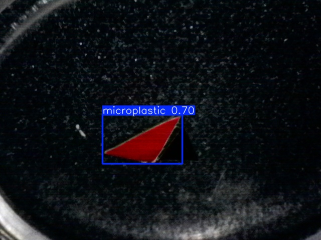
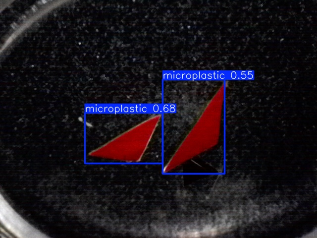

<div align="center">

# 🔬 IoT-Integrated AI System for Microplastic Detection in Water

[](https://python.org)
[](https://docs.ultralytics.com)
[](https://www.raspberrypi.com/)
[](LICENSE)
[](https://opencv.org)
[](https://powerbi.microsoft.com)

**A Raspberry Pi 4–powered edge-AI system that detects microplastics in water samples using YOLO object detection, integrated with IoT sensors for real-time water quality monitoring and a Power BI dashboard for data analytics.**

[Getting Started](#-getting-started) •
[Features](#-features) •
[Architecture](#-system-architecture) •
[Results](#-model-performance) •
[IoT Sensors](#-iot-sensor-integration) •
[Dashboard](#-power-bi-dashboard) •
[Usage](#-usage)

---

</div>

## 🌊 The Problem

Microplastics — tiny plastic fragments smaller than 5mm — are now found in **every ocean, river, and drinking water source** on Earth. Traditional detection requires:

- 💰 Expensive laboratory equipment (FTIR spectroscopy, Raman microscopy)
- ⏳ Days of sample processing and analysis  
- 🏢 Centralized lab access — not feasible for field research
- 📊 No real-time environmental context (temperature, turbidity, TDS)

**This project solves that** by deploying an AI-powered detection system on a Raspberry Pi with integrated water quality sensors — providing instant, contextualized microplastic analysis anywhere, offline.

---

## ✨ Features

| Feature | Description |
|---------|-------------|
| 🧠 **Edge AI Detection** | YOLOv5 Nano runs directly on Raspberry Pi 4 — zero cloud dependency |
| 📷 **Microscope Imaging** | USB microscope camera captures water samples for analysis |
| 🌡️ **Temperature Sensing** | DS18B20 sensor measures water temperature via 1-Wire protocol |
| 💧 **Turbidity Monitoring** | Analog turbidity sensor via MCP3008 ADC (SPI) |
| ⚡ **TDS Measurement** | Total Dissolved Solids sensor provides water quality metrics |
| 📍 **Auto Geolocation** | IP-based location tagging for field data collection |
| 📊 **CSV Data Logging** | Every scan logs detection count + all sensor readings + location |
| 📈 **Power BI Dashboard** | Interactive analytics dashboard for historical data visualization |
| 🌐 **Offline & Portable** | Works in remote field locations without internet |
| 💾 **Auto-Save** | Saves annotated detection images with timestamps |

---

## 🏗 System Architecture

The system operates across **4 layers** and **7 phases**, from offline model training through real-time Power BI visualization:


> 📖 **[Read the full technical architecture breakdown →](docs/ARCHITECTURE.md)**

### Architecture Layers

| Layer | Components | Role |
|-------|-----------|------|
| **Hardware Layer** | Raspberry Pi 4, MCP3008 ADC, DS18B20, Camera | Sensor I/O, compute node |
| **Application Layer** | Python `venv`, OpenCV, YOLO, SPI/1-Wire drivers | Detection + sensor polling |
| **Data Layer** | CSV logging, geolocation, data validation | Unified data serialization |
| **Presentation Layer** | SAMBA (SMB), Power BI, Power Query | Real-time dashboard via LAN |

---

## 🛠 Tech Stack

| Category | Technology |
|----------|-----------|
| **Hardware** | Raspberry Pi 4 (4GB), USB Microscope Camera |
| **Sensors** | DS18B20 (Temp), Turbidity Sensor, TDS Sensor, MCP3008 ADC |
| **Language** | Python 3.9+ |
| **ML Framework** | Ultralytics (YOLOv5 Nano) |
| **Deep Learning** | PyTorch |
| **Computer Vision** | OpenCV, NumPy, Pillow |
| **IoT Protocols** | SPI (MCP3008), 1-Wire (DS18B20) |
| **Geolocation** | Geocoder (IP-based) |
| **Analytics** | Power BI, Pandas, Matplotlib |
| **Annotation Tool** | MakeSense.AI |
| **Platform** | Raspberry Pi OS (64-bit) |

---

## 📁 Project Structure

```
📦 microplastic-detection/
├── 📁 assets/                    # README images & diagrams
│   ├── Flowchart.png             # 🆕 Full system architecture flowchart
│   ├── results.png               # Training curves
│   ├── confusion_matrix.png      # Model confusion matrix
│   ├── BoxPR_curve.png           # Precision-Recall curve
│   └── sample_detection.jpg      # Detection example
├── 📁 configs/
│   └── data.yaml                 # Dataset configuration
├── 📁 dataset/
│   └── images/
│       ├── train/                # Training images
│       ├── val/                  # Validation images
│       └── test/                 # Test images
├── 📁 docs/                      # 🆕 Technical documentation
│   └── ARCHITECTURE.md           # Detailed system architecture guide
├── 📁 notebooks/
│   ├── microplastics1.ipynb      # Data exploration & preprocessing
│   └── microplastics2.ipynb      # Model training & evaluation
├── 📁 output/                    # Detection output images (auto-generated)
├── 📁 results/                   # Best training results & metrics
│   ├── weights/best.pt           # Trained model weights
│   ├── confusion_matrix.png
│   ├── results.png
│   └── results.csv
├── 📁 src/
│   ├── detect.py                 # Batch inference script
│   ├── train.py                  # Model training script
│   ├── capture.py                # Basic camera detection
│   └── live_detect.py            # 🆕 Full IoT scan + sensor logging
├── microplastics_data.csv        # 🆕 Field data with sensor readings
├── .gitignore
├── LICENSE
├── README.md
├── requirements.txt
└── setup_pi.sh                   # Raspberry Pi setup script
```

---

## 🔌 IoT Sensor Integration

### Hardware Wiring

| Sensor | Interface | Pi Pin | Details |
|--------|-----------|--------|---------|
| **DS18B20** (Temperature) | 1-Wire | GPIO 4 | Digital, waterproof probe |
| **Turbidity Sensor** | Analog → MCP3008 CH0 | SPI (CE0) | Measures light scatter in water |
| **TDS Sensor** | Analog → MCP3008 CH1 | SPI (CE0) | Total Dissolved Solids (ppm proxy) |
| **MCP3008 ADC** | SPI | GPIO 8-11 | 10-bit, 8-channel ADC converter |

### Data Logging Format

Every scan captures a full environmental snapshot:

```csv
Date_Time,Location,Coordinates,Image_Name,Microplastic_Count,Temp_C,Turbidity_V,TDS_V
2026-02-20 17:39:12,"Mumbai, Maharashtra","19.076, 72.8777",scan_173912.jpg,3,28.45,1.82,0.95
```

### Scan Workflow

```
Press 's' in live view:
   1. 📷 Capture frame from microscope
   2. 🧠 Run YOLO detection → count microplastics
   3. 🌡️ Read temperature (DS18B20)
   4. 💧 Read turbidity voltage (MCP3008 CH0)
   5. ⚡ Read TDS voltage (MCP3008 CH1)
   6. 📍 Tag with GPS coordinates
   7. 💾 Append to CSV + save annotated image
```

---

## 📊 Power BI Dashboard

The project includes a **Power BI dashboard** (`Microplastic dashboard.pbix`) for interactive analysis of collected field data:

- 📈 **Detection trends** over time
- 🗺️ **Geographic distribution** of microplastic contamination
- 🌡️ **Correlation analysis** between sensor readings and detection counts
- 📋 **Summary statistics** per sampling location

> To use: Open `Microplastic dashboard.pbix` in Power BI Desktop and connect to `microplastics_data.csv`

---

## 🚀 Getting Started

### Prerequisites

- **Python 3.9+**
- **CUDA GPU** (for training) or **Raspberry Pi 4** (for deployment)
- **USB Microscope Camera** or Pi Camera Module

### Installation

```bash
# 1. Clone the repository
git clone https://github.com/Ajinkya8472/Iot-Integrated-AI-System-for-Microplastic-Detection-in-Water-.git
cd Iot-Integrated-AI-System-for-Microplastic-Detection-in-Water-

# 2. Create virtual environment
python -m venv venv
source venv/bin/activate        # Linux/Mac
# venv\Scripts\activate         # Windows

# 3. Install dependencies
pip install -r requirements.txt
```

### Raspberry Pi Setup (One-Time)

```bash
chmod +x setup_pi.sh
./setup_pi.sh
```

---

## 📖 Usage

### 🔬 Live Scan Mode (IoT + Sensors)

The primary mode — combines YOLO detection with sensor readings:

```bash
python src/live_detect.py
```

**Controls:**
| Key | Action |
|-----|--------|
| `s` | Scan frame + read sensors + log to CSV |
| `q` | Quit and save session |

### 🔍 Batch Inference on Images

```bash
# Single image
python src/detect.py --source path/to/sample.jpg --weights results/weights/best.pt

# Directory of images
python src/detect.py --source dataset/images/test/ --weights results/weights/best.pt

# Adjust confidence threshold
python src/detect.py --source image.jpg --weights results/weights/best.pt --conf 0.3
```

### 📷 Basic Camera Detection (No Sensors)

```bash
# On Raspberry Pi
python src/capture.py --weights results/weights/best.pt

# On desktop with webcam
python src/capture.py --weights results/weights/best.pt --no-pi --camera 0
```

### 🏋️ Train a New Model

```bash
# Train with YOLOv5 Nano (default)
python src/train.py --data configs/data.yaml --epochs 50

# Train with YOLO11 Nano
python src/train.py --data configs/data.yaml --model yolo11n.pt --epochs 100

# Custom training
python src/train.py --data configs/data.yaml --model yolov5nu.pt \
    --epochs 80 --batch 16 --imgsz 640 --patience 20 --lr0 0.01
```

---

## 📊 Model Performance

### Training Configuration

| Parameter | Value |
|-----------|-------|
| Base Model | YOLOv5 Nano (Ultralytics) |
| Epochs | 50 |
| Batch Size | 16 |
| Image Size | 640 × 640 px |
| Optimizer | Auto (SGD) |
| Learning Rate | 0.01 → 0.0001 |
| Augmentation | Mosaic, Flip, HSV, Erasing |

### Key Metrics

| Metric | Best Value | Epoch |
|--------|-----------|-------|
| **mAP@50** | 0.496 | 18 |
| **mAP@50-95** | 0.193 | 35 |
| **Precision** | 0.574 | 42 |
| **Recall** | 0.439 | 26 |
| **Box Loss** | 1.447 | 48 |
| **Cls Loss** | 0.727 | 48 |

> **Note:** Model is under active development. Performance metrics will improve with more training data and hyperparameter tuning.

### Training Curves


### Confusion Matrix


### Precision-Recall Curve


### Live Field Detections
Real-world performance captured during field testing using the USB microscope:

| Detection 1 | Detection 2 |
| :---: | :---: |
|  |  |

*Red bounding boxes indicate positively identified microplastic particles with confidence scores, mapped back to the edge device's real-time telemetry.*

---

## 🔮 Roadmap

- [x] YOLOv5 Nano training pipeline
- [x] Real-time camera detection system
- [x] IoT sensor integration (Temperature, Turbidity, TDS)
- [x] Automated CSV data logging with geolocation
- [x] Power BI analytics dashboard
- [x] Field testing (Mumbai, Pimpri-Chinchwad)
- [ ] Multi-class detection (fiber, fragment, film, pellet)
- [ ] TFLite / NCNN model export for optimized Pi inference
- [ ] Web-based monitoring dashboard (Flask/Streamlit)
- [ ] YOLO11 model comparison and benchmarks
- [ ] Integration with additional water quality sensors (pH, DO)
- [ ] Alert system for high contamination readings

---

## 🧪 Field Testing

The system has been tested in real-world conditions:

| Location | Date | Samples | Detections |
|----------|------|---------|------------|
| Mumbai, Maharashtra | Feb 2026 | 11 | Microplastics found in all samples |
| Pimpri-Chinchwad, Maharashtra | Mar 2026 | 3+ | Varying contamination levels |

---

## 🤝 Contributing

Contributions are welcome! Here's how to get involved:

1. **Fork** the repository
2. **Create** your feature branch (`git checkout -b feature/amazing-feature`)
3. **Commit** your changes (`git commit -m 'Add amazing feature'`)
4. **Push** to the branch (`git push origin feature/amazing-feature`)
5. **Open** a Pull Request

---

## 📄 License

This project is licensed under the MIT License — see the [LICENSE](LICENSE) file for details.

---

## 🙏 Acknowledgments

- [Ultralytics YOLO](https://docs.ultralytics.com/) — Object detection framework  
- [MakeSense.AI](https://www.makesense.ai/) — Image annotation tool  
- [Raspberry Pi Foundation](https://www.raspberrypi.com/) — Edge computing hardware  

---

<div align="center">

**Built with ❤️ for cleaner water**

⭐ Star this repo if you found it useful!

</div>
